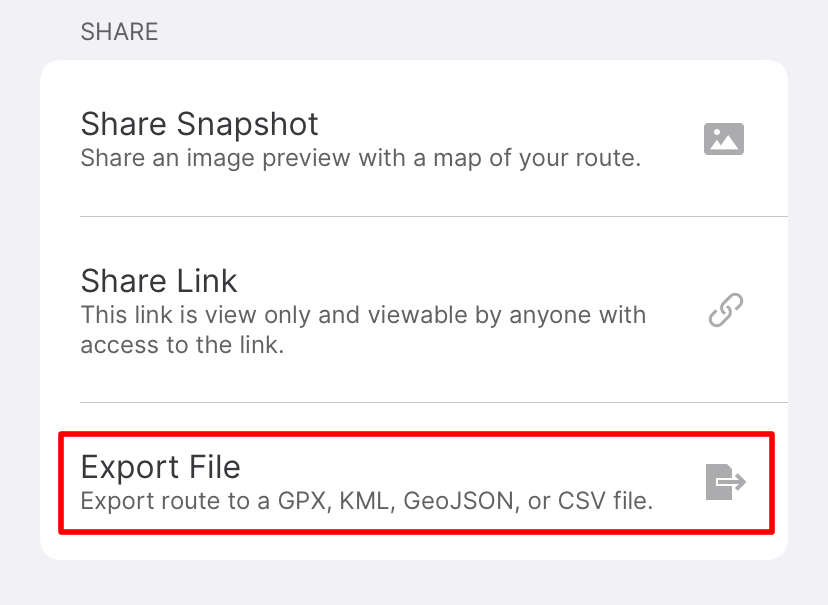

# GpxRouteToTrack

Last update: 2022-02-10

## Overview

This script converts a Route in a GPX file generated by Gaia GPS into a GPX Track for import into Garmin Explore. It is written to run in [Pythonista 3](https://www.omz-software.com/pythonista/) as a sharing action, which allows it to be used offline.

I haven't verified that GPX Tracks generated by this script conform to the GPX schema—only that they work when imported by Garmin Explore.

## Background

When hiking I use a Garmin GPS watch for navigation, which helps a great deal with staying on course and generally not getting lost. But when it comes to planning a route on the go—often without an Internet connection—my favorite tool is the [Gaia GPS](https://www.gaiagps.com/) iPhone app, which provides high-quality, downloadable map tiles from USFS, NPS, NatGeo and others, and which has a well thought-out touch interface for drawing routes.

Once I've created a route in Gaia GPS, ideally I'd like to sync it to my Garmin watch for navigation. This is mostly possible by sharing the GPX file from Gaia to the [Garmin Explore](https://explore.garmin.com/) app, which can then sync with the watch over Bluetooth, all without relying on the Internet.

(Garmin Explore has its own route drawing features, but at the time of writing I find the Explore iOS app's trail maps extremely difficult to read.)

But there's a catch: The Gaia GPS app exports [GPX Routes instead of Tracks](https://stackoverflow.com/questions/9992705/what-is-the-difference-between-track-and-route-in-a-gpx-file). When importing a GPX Route, Garmin Explore treats route points as explicit waypoints, which leads to a cluttered display when using the Route on the watch:

This can be avoided by converting the GPX Route into a Track in web applications like [GPS Visualizer](https://www.gpsvisualizer.com/). But I need to be able to perform the entire route planning and sync workflow offline.

## Installation

If you don't have it installed already, [install Pythonista 3 from the App Store](https://apps.apple.com/us/app/pythonista-3/id1085978097).

Copy `GpxRouteToTrack.py` into Pythonista's local storage on your iPhone. In Pythonista, [configure the script to run as a Share Sheet extension](https://omz-software.com/pythonista/docs/ios/pythonista_shortcuts.html#pythonista-share-extension).

## Usage

Create a route in Gaia GPS, then touch Share:

Choose to export the route as a file:

Select the GPX file type for export:

Select "Run Pythonista Script":

Choose the `GpxRouteToTrack` script:

Share the output of the `GpxRouteToTrack` script, in turn, to Garmin Explore:

Finally, Garmin Explore should indicate that the track was imported successfully:

